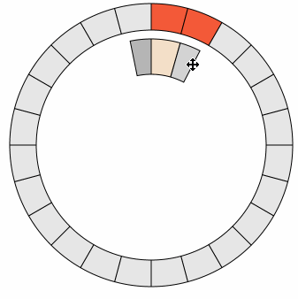

d3.svg.circularbrush
===============

A control for selecting cyclical data. Like d3.svg.brush, it fires "brushstart", "brush" and "brushend" events when you drag the resize areas or extent. Here's an example based on a [24-hour clock](http://bl.ocks.org/emeeks/905c4691f343fc4780bd).

**#circularbrush.range** defines the range of the brush. The domain is fixed at 0,2π, and so the range needs to be a corresponding two value array (such as [1,24] for hours of the day). Defaults to [0,2π].

**#circularbrush.innerRadius** sets the inner radius of the brush (which uses d3.svg.arc). Defaults to 50.

**#circularbrush.outerRadius** sets the outer radius of the brush (which uses d3.svg.arc). Defaults to 100.

**#circularbrush.handleSize** sets the size of the handles in radians. Defaults to .2

**#circularbrush.extent()** returns or sets the current extent of the brush based on the set **range** of the brush.